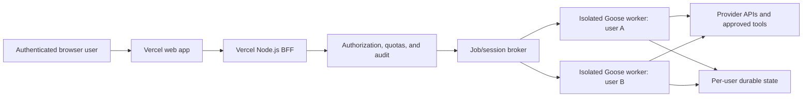

# Future Vercel Architecture

## Decision

Vercel will serve the future web product, but a standard Vercel deployment will not run the existing Goose desktop application or a long-lived, privileged Goose daemon.

The current application assumes a trusted local user and gives the Goose process powerful tools. A public product must introduce an explicit multi-user security boundary before reusing those capabilities.

## Target Topology

### Vercel web app

- Add a separate browser package such as `ui/web` rather than trying to convert `ui/desktop` in place.
- Reuse presentation components only after removing Electron, Node-only, filesystem, and desktop IPC assumptions.
- Prefer the existing `ui/sdk` ACP types and transports where they are browser-safe.
- Keep every provider and worker credential server-side.

### Backend-for-frontend

- Authenticate every request and resolve it to an internal user ID.
- Authorize every session, file, tool, and worker action.
- Issue narrowly scoped, short-lived worker/session credentials; never reuse the local shared ACP secret as user authentication.
- Enforce per-user and per-organization rate, concurrency, token, storage, and spend limits.
- Record security-relevant audit events without logging raw secrets or unnecessary prompt content.

### Goose execution plane

Use one of these models after a prototype and threat review:

1. A container/VM platform for long-lived ACP HTTP/WebSocket workers.
2. Vercel Sandbox for bounded, isolated Goose jobs, with explicit persistence and timeout policies.
3. A hybrid in which Vercel owns the frontend and session broker while a dedicated compute provider owns Goose workers.

Workers must be isolated by tenant. Do not mount developer laptops, shared SSH agents, shared cloud credentials, or a common writable workspace into public workers.

## Why Standard Vercel Functions Are Not the Goose Runtime

- The Goose backend is a compiled Rust process with local state and subprocess/tool execution.
- The interactive ACP endpoint supports HTTP and WebSocket, while standard Vercel Functions cannot act as WebSocket servers.
- Functions have request duration, bundle size, memory, payload, and file-descriptor limits.
- Serverless instances are not a durable per-user filesystem or a safe general-purpose code-execution sandbox.

Vercel Functions remain appropriate for authentication callbacks, authorization checks, CRUD APIs, session brokering, and bounded orchestration.

## Minimum Security Gates Before a Public Preview

- [ ] Product authentication is implemented with secure sessions and CSRF protection where applicable.
- [ ] Tenant authorization tests prove one user cannot read or operate another user's sessions, files, workers, or logs.
- [ ] Every worker is isolated and has CPU, memory, disk, network, duration, and concurrency limits.
- [ ] Tool permissions default to deny; high-impact actions require explicit user confirmation.
- [ ] Outbound network access is allowlisted or monitored, with defenses against SSRF and cloud metadata access.
- [ ] Uploaded files, repository content, web pages, recipes, MCP servers, and hook output are treated as prompt-injection inputs.
- [ ] Provider credentials are encrypted, scoped, rotatable, and never exposed to the browser or another tenant.
- [ ] The system has request, token, tool, storage, and dollar-denominated budgets with hard stops.
- [ ] Logs redact secrets and minimize prompt/user data; retention and deletion policies are documented.
- [ ] Abuse controls, incident response, backup/restore, dependency scanning, and rollback procedures exist.
- [ ] The Goose/Block/AAIF naming and Apache 2.0 redistribution obligations have been reviewed.

## Delivery Phases

### Phase 0: local understanding

Build and test upstream unchanged. Trace one message from the desktop React client through ACP to the Rust agent and back.

### Phase 1: static authenticated shell

Create `ui/web` with authentication, navigation, and mocked conversations. Deploy only previews. No Goose runtime or provider credentials are connected.

### Phase 2: read-only remote session prototype

Connect the web client to a development worker through a server-side broker. Disable command execution, file writes, arbitrary MCP servers, hooks, and schedulers.

### Phase 3: isolated bounded tools

Introduce one reviewed tool at a time inside per-user sandboxes. Add approvals, quotas, audit events, and adversarial tests before broadening access.

### Phase 4: limited public beta

Use separate production infrastructure and credentials, conservative limits, a kill switch, monitored spend, incident response, and an explicit supported feature set.

## Vercel Project Convention When `ui/web` Exists

- Set the Vercel project root directory to `ui/web` (or the final isolated web package).
- Use the package manager and lockfile committed by the repository.
- Keep preview and production environment variables separate.
- Only variables intentionally safe for browsers may use a public prefix.
- Require preview checks before promotion and retain a known-good rollback deployment.
- Do not add a root `vercel.json` that causes Vercel to upload or build the entire Goose monorepo without a demonstrated need.

## Current Blocker to Direct Browser Connection

The local `goose serve` authentication model uses a server secret, and the desktop WebSocket URL can carry that token. Sending a shared server secret to untrusted browsers would allow credential extraction and cross-user access. A production web client therefore requires a brokered, per-user authorization design before it connects to privileged Goose workers.
